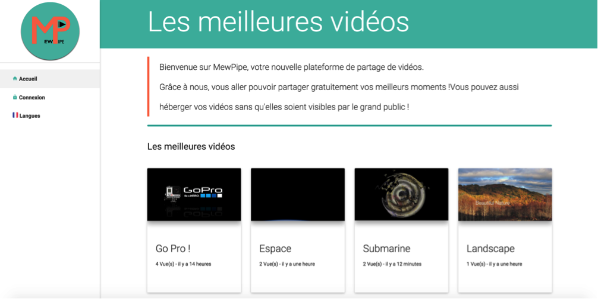
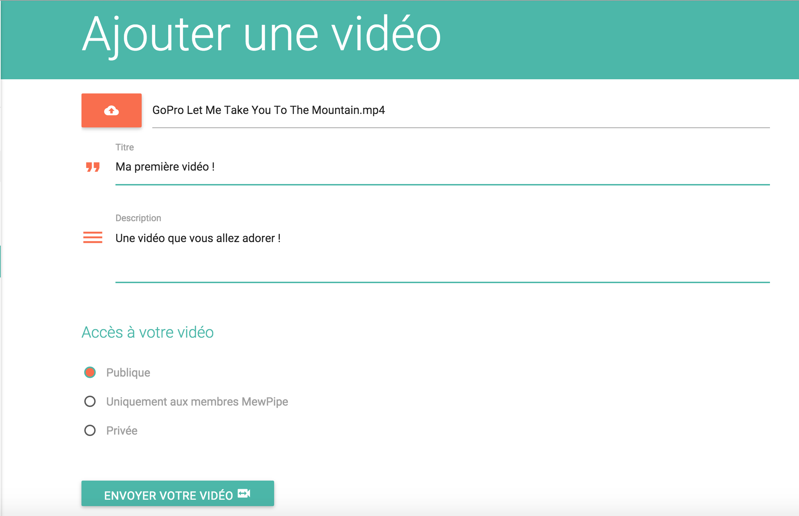
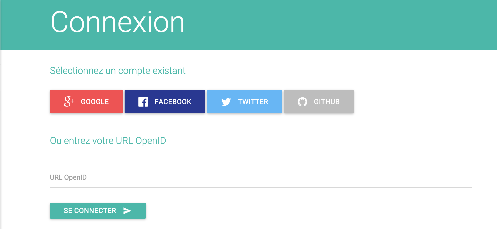
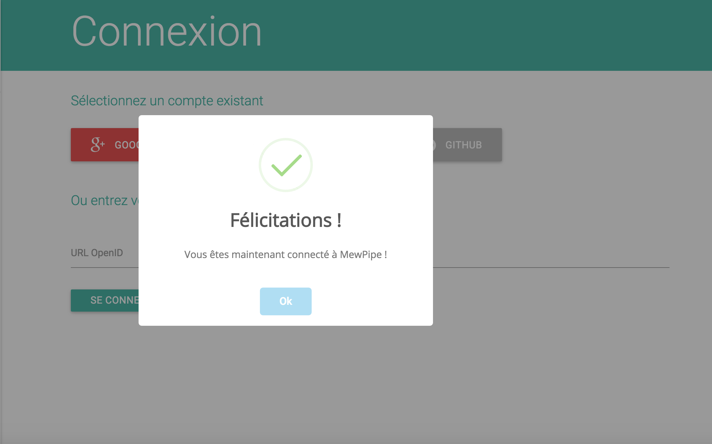

# MewPipe (frontend)

MewPipe est une application Web d'hébergement de vidéos. 
Cela vous permettra d'ajouter des vidéos, de les éditer, les visionner et les partager à l'ensemble de la communauté.

Une authentification via OpenID a été implémentée afin de permettre aux utilisateurs de se connecter sans créer un nouveau compte. Ils pourront ainsi s'authentifier grâce à leur compte Facebook, Twitter, Google ou encore GitHub.

Les technologies utilisées sont Sails.JS, Angular.JS ainsi que SQL Server.

Voici quelques captures d'écran de l'application, dont le design a été basé sur [materializecss](http://materializecss.com/) : 

------------------

------------------

------------------

------------------

Voici le lien vers la [partie Backend de l'application](https://github.com/mehdibeldji/mewpipe-backend) 

